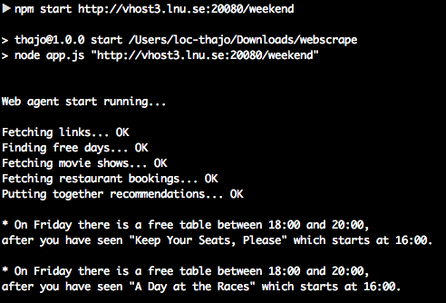

## Examination assignment 1

In this assignment the task is to write a [web scraper](https://en.wikipedia.org/wiki/Web_scraping) that scrapes but also analyzes information on some, for this assignment constructed, Web sites. The idea is that you are going to write a scraper/agent that is constructed to solve a specific problem.

You will get an to proceed from which links to three different web sites. You don´t have to care about how they are work or their structure, just the HTML they are rendering and how to form your HTTP request to get the data you want for analyzing.  

Your starting point is: **http://vhost3.lnu.se:20080/weekend**, which also should be your start point in your scraping script meaning that no more hardcoded URLs should be used in your code (except for the AJAX-call in the movie-site maybe) .

## Scenario
The three friends Peter, Paul and Mary usually get together some weekend every month to see a movie and after that eat at a restaurant.
The problem is that it is hard to plan this event since they must find a time slot when all three are available, look for a movie that plays at the cinema that day and finally see if they can book a table at their favourite restaurant. Since all this information is available through HTTP requests it would be nice to have a script that automates this workflow!

And that's your task...

### The web sites
Your script should start to scrape the links at the starting-URL and continue from that. This starting-URL should be easy to change when running your script. Remember that we are going to examine your scraper against another server when examinating it. As said, from this URL your application/web scraper should be able to crawl all three applications by it self. The scraper should be able to scrape all information, analyze it and present a solution to the user in a good way. Of course there will be some points internally in the web sites where we have to hardcode but try to write it as general as possible (see examinations for more info).

#### The calendar
The first Web site is where the three friends are syncing their calendar. Each of the friends have their own page where he/she can edit the information to let the others see what day of the weekend is free. These pages are built with simple HTML and the task is to scrape the pages and analyze on what (if any) day(s) all three friends are free. The friends are only available to see each other on the weekends (Friday, Saturday, Sunday) so there is no need to handle more or different days.

#### The cinema
The cinema Web site is a simple Web site that displays the cinemas shows for the weekend. You can get which day and at which time a specific movie is running and if it is fully booked or not. **By analyzing the traffic between the client and the server you should be able to find a way to request this information** to analyze it in your code together with the data from the calendar site. Use the browsers inspector to analyze the traffic.

#### The restaurant
The third web site is the three friends' favorite restaurant (the only one they visit...). To see this site, you must login first
For this you can use:
* username: **zeke**
* password: **coys**

The site will use session cookies for authorization which your application must handle in some way. 
After this you can see the available booking times which you should analyze with the other data to propose.

## The workflow to automate
* Check which day or days all friends are available, if none - output this on screen
* Get the available movies for that day(s)
* Login to the restaurant Web site and get the content
* See when the three friends can eat. Think that they want to book a table **minimum two hours after the movie starts.**
* Present the solution(s) as output in your terminal/console window (or as a HTML view)
* [Optional] - Use the form for a user to book a table with your application

## What the application should look like
The output of the application should look something like this:

As you can see the application should start with `npm start` and a URL as an argument to the process.
The output should not be more "loud" then this. Be sure to remove all your other console.log before making your release.
The result is the correct one for the current state of the sites - You could use it to check your solution

## Requirements of your solution
* The application should be written as a Node.js application in Javascript
* The only command the examinator should do tor run your application when cloning it from GitHub is `npm install` and `npm start`
* You should work with GitHub and **do several commits** to show how your solution has been made.
* You are free to find and use external modules 
* The application **should be able to take a parameter with the start-URL** so one easy could change servers when running the examination.
* Try to make a solution that is as general as possible. The examination of the assignment may will be done on a by the examinators provided server where some changes has been made. This is to test that your code is general for different scenarios. **The HTML structure will never be changed** but there could be changes in:
  * href-attributes in HTML: To check that your scraper doesn't use hardcoded URLs. URLs only defined in Javascript-code (as in the AJAX and movie-example) will not be changed so you can hardcode these.
  * The day(s) all three friends will be available, if none the application should give the end-user a massage about that
  * The movie titles, their time and if they are fully booked or not
  * The availability of tables at the restaurant and the redirect URL we are getting when we log in.
* To submit your solution and tell the examinators that you are ready **you must do a release of your code on your GitHub repo** otherwise will you not get feedback and the examinators will check back at the re-exam date

## Examination
There will not be a oral examination combined with this assignment. The examinators will tell you if your solution is Pass or Fail trough a issue on your GitHub repo.

## Goals with this assignment
* Get practical experience of building a web scraper
* Get knowledge about HTTP and use it when building an application in Node.js
* Analyze the traffic between the client and the server
* Get practical knowledge of asynchronous programming in Node.js
* Analyze and solve a problem with Javascript code
* Using Git to show progress in your work
